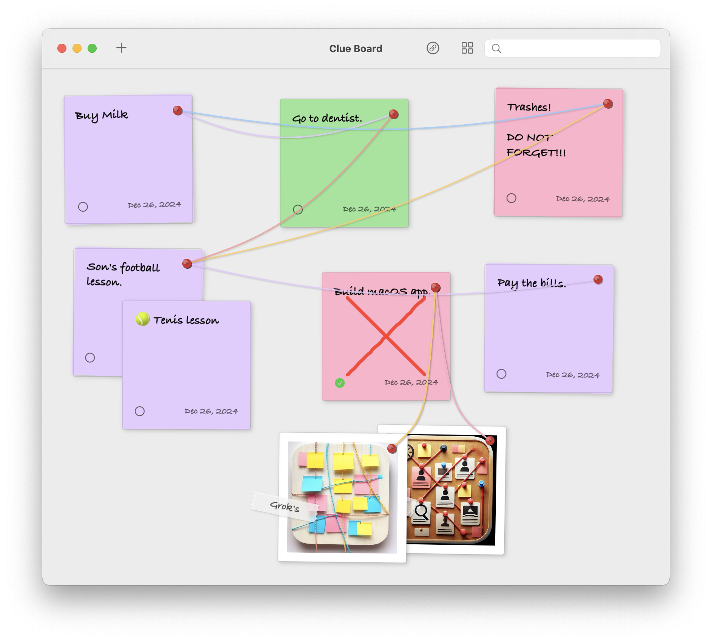

# Clues

A simple and beautiful sticky notes app for macOS. Create, organize, and connect your ideas visually.



## Features

- 📝 Create sticky notes with beautiful colors
- 🔗 Connect related notes with strings
- 🖼️ Drag & drop images
- 🔍 Search through your notes
- 📱 iCloud sync support
- 🎨 Clean, native macOS design

## Installation

### Direct Download

Download the latest version from the [Releases](https://github.com/f/Clues.app/releases) page:

1. Download `Clues.dmg`
2. Open the DMG file
3. Drag Clues.app to your Applications folder
4. Launch from Applications or Spotlight

### Requirements

- macOS 14.0 (Sonoma) or later
- Internet connection for iCloud sync

## Usage

- Create new notes with Cmd + T
- Connect notes by entering connection mode (Cmd + L)
- Search notes using the search bar
- Organize notes with the "Tidy Up" feature
- Save your boards as .clues files
- Access your boards from any device with iCloud sync

## Development

### Building from Source

1. Clone the repository:
```bash
git clone https://github.com/f/clues.git
cd clues
```

2. Open in Xcode:
```bash
open Clues.xcodeproj
```

3. Build and run (Cmd + R)

### Creating a Release Build

Use the included build script:
```bash
./build_app.sh
```

This will create:
- A standalone .app in `build/Clues.app`
- A distributable DMG in `build/Clues.dmg`

## Contributing

Pull requests are welcome! For major changes, please open an issue first to discuss what you would like to change.

## License

[MIT](LICENSE)

## Author

Created by [Fatih Kadir Akın](https://x.com/fkadev) using AI tools. 
